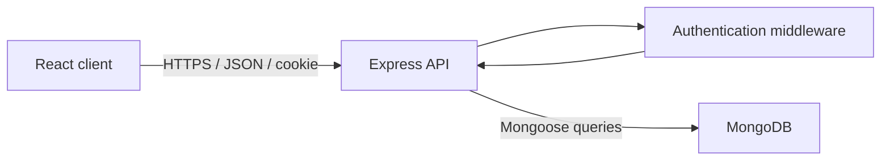

# TaskFlow Design

## Frontend routes

| Route       | Access        | Purpose                                       |
| ----------- | ------------- | --------------------------------------------- |
| `/register` | Guest only    | Create an account                             |
| `/login`    | Guest only    | Sign in                                       |
| `/`         | Authenticated | View and manage tasks                         |
| `*`         | Any           | Redirect to the appropriate application route |

## User journeys

### Registration

1. A visitor opens `/register`.
2. The visitor enters their name, email, and password.
3. The client validates the form.
4. The API validates the request again.
5. The API checks whether the normalized email already exists.
6. The password is hashed using bcrypt.
7. The user is created.
8. The API creates a JWT session cookie.
9. The client redirects the user to the task dashboard.

### Login

1. A visitor opens `/login`.
2. The visitor submits their email and password.
3. The API validates the request.
4. The API loads the user, including the normally hidden password hash.
5. bcrypt compares the submitted password with the stored hash.
6. Invalid credentials return the same generic error.
7. Valid credentials produce a JWT session cookie.
8. The client redirects the user to the dashboard.

### Session restoration

1. The application starts or the browser is refreshed.
2. The client requests `/api/auth/me`.
3. The browser automatically includes the httpOnly cookie.
4. The authentication middleware verifies the JWT.
5. A valid session returns the current public user.
6. An invalid or expired session returns HTTP 401.
7. The client displays either the dashboard or login page.

### Task management

1. The authenticated user opens the dashboard.
2. The client requests the user's tasks.
3. The API derives the owner from the verified JWT, never from client input.
4. The user can create, edit, move, search, filter, and delete tasks.
5. Successful mutations refresh or update the displayed task collection.
6. Expected failures display clear user-facing feedback.

### Logout

1. The authenticated user selects Sign out.
2. The client sends `POST /api/auth/logout`.
3. The API clears the authentication cookie.
4. The client removes cached private data.
5. The user is redirected to `/login`.

## System architecture

TaskFlow uses an npm-workspaces monorepo containing separate client and server applications.

### Client responsibilities

- Render the user interface.
- Manage routes and protected navigation.
- Perform immediate form validation.
- Send credentials with API requests.
- Manage server state, loading states, mutations, and cache invalidation.
- Display API validation and application errors.
- Provide responsive and accessible interactions.

### Server responsibilities

- Validate all untrusted request data.
- Authenticate requests.
- Enforce task ownership.
- Hash and compare passwords.
- Create and verify JWTs.
- Execute database operations.
- Return consistent success and error responses.
- Log unexpected failures without exposing secrets.

### Database responsibilities

- Persist users and tasks.
- Enforce schema constraints.
- Provide indexes for common queries.
- Store dates as BSON Date values.
- Store password hashes, never plaintext passwords.



## Environments

### Local development

- React runs through Vite on port 5173.
- Express runs on port 5000.
- Vite proxies `/api` requests to Express.
- MongoDB runs locally on port 27017.
- Authentication cookies are not marked Secure because local development uses HTTP.

### Production

- React is compiled into static files.
- Express serves the compiled React application.
- Express handles all `/api` routes.
- The application uses a single Render HTTPS origin.
- MongoDB Atlas stores production data.
- Authentication cookies are Secure.
- Secrets are configured through Render environment variables.

```text
Browser
   │
   │ HTTPS
   ▼
Render Node service
   ├── /api/* → Express routes
   └── /*      → React production files
                    │
                    ▼
               MongoDB Atlas
```

## Database design

### User

| Field          | Type     | Rules                                                        |
| -------------- | -------- | ------------------------------------------------------------ |
| `_id`          | ObjectId | Generated by MongoDB                                         |
| `name`         | String   | Required, trimmed, 2–60 characters                           |
| `email`        | String   | Required, trimmed, lowercase, unique, maximum 254 characters |
| `passwordHash` | String   | Required, excluded from normal query results                 |
| `createdAt`    | Date     | Generated automatically                                      |
| `updatedAt`    | Date     | Generated automatically                                      |

### User indexes

- A unique index on `email`.

### Task

| Field         | Type     | Rules                                |
| ------------- | -------- | ------------------------------------ |
| `_id`         | ObjectId | Generated by MongoDB                 |
| `owner`       | ObjectId | Required reference to User           |
| `title`       | String   | Required, trimmed, 1–100 characters  |
| `description` | String   | Required, trimmed, 1–1000 characters |
| `status`      | String   | `todo`, `in-progress`, or `done`     |
| `priority`    | String   | `low`, `medium`, or `high`           |
| `dueDate`     | Date     | Required valid date                  |
| `createdAt`   | Date     | Generated automatically              |
| `updatedAt`   | Date     | Generated automatically              |

### Date representation

The task API accepts the due date as a valid ISO date string. The client sends
`YYYY-MM-DD` from the date input. MongoDB stores it as a BSON Date, and API
responses serialize it as an ISO 8601 UTC timestamp.

### Task indexes

- `{ owner: 1, dueDate: 1, _id: 1 }`
- `{ owner: 1, status: 1, priority: 1, dueDate: 1 }`

### Title-search tradeoff

The assessment requires partial title matching. The first version uses an escaped,
case-insensitive regular expression scoped to the authenticated owner.

A contains-style regular expression cannot efficiently use a normal title index.
This is acceptable for an assessment-sized user dataset. A production system with
large datasets could use MongoDB Atlas Search with an autocomplete index.

## API response contract

### Successful response

```json
{
  "success": true,
  "data": {}
}
```

### Error response

#### Validation error

```json
{
  "success": false,
  "message": "Please correct the highlighted fields",
  "details": [
    {
      "field": "title",
      "message": "Title is required"
    }
  ]
}
```

#### General error

```json
{
  "success": false,
  "message": "Task not found"
}
```

## HTTP status codes

| Status | Meaning                                     |
| ------ | ------------------------------------------- |
| `200`  | Successful read or update                   |
| `201`  | Resource created                            |
| `204`  | Successful operation with no response body  |
| `400`  | Invalid request data                        |
| `401`  | Missing, invalid, or expired authentication |
| `404`  | Route or owned resource not found           |
| `409`  | Duplicate email conflict                    |
| `429`  | Too many requests                           |
| `500`  | Unexpected server error                     |

## Authentication API

### POST `/api/auth/register`

Request:

```json
{
  "name": "Mohammed Sayed",
  "email": "mohammed@example.com",
  "password": "SecurePass1"
}
```

**Success: 201 Created**

```json
{
  "success": true,
  "data": {
    "user": {
      "id": "user-id",
      "name": "Mohammed Sayed",
      "email": "mohammed@example.com"
    }
  }
}
```

### POST `/api/auth/login`

Request:

```json
{
  "email": "mohammed@example.com",
  "password": "SecurePass1"
}
```

**Success: 200 OK**

### POST `/api/auth/logout`

**Success: 204 No Content**

### GET `/api/auth/me`

**Success: 200 OK**

```json
{
  "success": true,
  "data": {
    "user": {
      "id": "user-id",
      "name": "Mohammed Sayed",
      "email": "mohammed@example.com"
    }
  }
}
```

## Task API

### GET `/api/tasks`

Query parameters:

| Parameter  | Allowed values                                   | Default   |
| ---------- | ------------------------------------------------ | --------- |
| `search`   | String, maximum 100 characters                   | Empty     |
| `status`   | `todo`, `in-progress`, `done`                    | All       |
| `priority` | `low`, `medium`, `high`                          | All       |
| `page`     | Positive integer                                 | `1`       |
| `limit`    | Integer from 1 to 100                            | `12`      |
| `sort`     | `dueDate`, `-dueDate`, `createdAt`, `-createdAt` | `dueDate` |

Success: `200 OK`

```json
{
  "success": true,
  "data": {
    "tasks": [],
    "pagination": {
      "page": 1,
      "limit": 12,
      "total": 0,
      "pages": 1
    }
  }
}
```

### POST `/api/tasks`

Request:

```json
{
  "title": "Prepare technical presentation",
  "description": "Document architecture and important tradeoffs.",
  "status": "todo",
  "priority": "high",
  "dueDate": "2026-08-24T00:00:00.000Z"
}
```

**Success: 201 Created**

```json
{
  "success": true,
  "data": {
    "task": {
      "id": "task-id",
      "title": "Prepare technical presentation",
      "description": "Document architecture and important tradeoffs.",
      "status": "todo",
      "priority": "high",
      "dueDate": "2026-08-24T00:00:00.000Z",
      "createdAt": "2026-08-21T12:00:00.000Z",
      "updatedAt": "2026-08-21T12:00:00.000Z"
    }
  }
}
```

### PATCH `/api/tasks/:id`

Request:

```json
{
  "status": "in-progress",
  "priority": "medium"
}
```

**Success: 200 OK**

```json
{
  "success": true,
  "data": {
    "task": {
      "id": "task-id",
      "title": "Prepare technical presentation",
      "description": "Document architecture and important tradeoffs.",
      "status": "in-progress",
      "priority": "medium",
      "dueDate": "2026-08-24T00:00:00.000Z",
      "createdAt": "2026-08-21T12:00:00.000Z",
      "updatedAt": "2026-08-21T12:00:00.000Z"
    }
  }
}
```

The update request:

- Must contain at least one supported field.
- May only contain `title`, `description`, `status`, `priority`, or `dueDate`.
- Cannot change the task owner.
- Uses the same field constraints as task creation.

### Public task representation

Task responses contain `id`, `title`, `description`, `status`, `priority`,
`dueDate`, `createdAt`, and `updatedAt`.

They do not expose `owner`, `_id`, or `__v`.

### DELETE `/api/tasks/:id`

**Success: 204 No Content**

## Security decisions

- Passwords are hashed using bcrypt with an appropriate work factor.
- Password hashes are excluded from normal database queries.
- JWTs contain the user ID plus issuer, audience, issued-at, and expiration claims.
- JWTs expire after one day.
- The browser stores the JWT in an httpOnly cookie.
- Production cookies use Secure and SameSite=Lax.
- Authentication routes are rate limited.
- Helmet configures security-related HTTP headers.
- CORS uses an explicit allowed origin during local development.
- JSON request bodies have a small size limit.
- All body, parameter, and query inputs are validated.
- Search text is escaped before it is used in a regular expression.
- Task ownership is included directly in database queries.
- Production errors do not expose stack traces.
- Secrets are read from environment variables and never logged.
